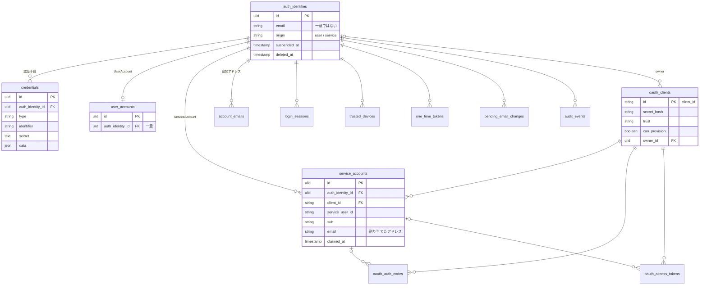

# データベース

PostgreSQL を使う。テーブルの定義は `database/migrations/` が正で、ここでは全体の構造と決まりごとを説明する。

用語は [用語リスト](term/README.md)、アカウントの仕組みは [アカウントモデル](ACCOUNTS.md) を参照。

## 全体像

`auth_identities` (認証主体) が中心にあり、ほとんどのテーブルがここにぶら下がる。

```text
auth_identities ─┬─ credentials            認証手段
                 ├─ user_accounts          UserAccount (0..1)
                 ├─ service_accounts ───── oauth_clients
                 ├─ account_emails         追加アドレス
                 ├─ login_sessions
                 ├─ trusted_devices
                 ├─ one_time_tokens
                 ├─ pending_email_changes
                 └─ audit_events

oauth_clients ─┬─ oauth_auth_codes
               └─ oauth_access_tokens
```




`pending_registrations` はまだ認証主体が無い段階の申し込みなので、どこにもつながらない。`auth_identity_aliases` は統合で消えた古い ID を指すため、外部キーは統合先 (`current_id`) にだけ張っている。

## テーブル

### アカウント

| テーブル | 内容 |
| --- | --- |
| `auth_identities` | 認証主体。主アドレス、表示名、アイコン、言語、`origin`、停止 (`suspended_at`)・退会 (`deleted_at`) |
| `user_accounts` | UserAccount。行があれば UserAccount を持っている。`auth_identity_id` は一意 |
| `service_accounts` | ServiceAccount。どのサービス (`client_id`) のどの利用者 (`service_user_id`) か、サービスに渡す `sub`、割り当てたアドレス (`email`)、移行済みか (`claimed_at`) |
| `account_emails` | 追加アドレス。サービスに渡すアドレスの選択肢で、ログインには使わない |
| `auth_identity_aliases` | 統合で消えた認証主体の古い ID から、統合先の ID を引くための表 |

### 認証

| テーブル | 内容 |
| --- | --- |
| `credentials` | 認証手段。`type` で種類を分け (`password`、`passkey`、`totp`、`oauth` など)、種類ごとの中身は `secret` と `data` (JSON) に入れる |
| `login_sessions` | ログイン中の端末ごとの記録 |
| `trusted_devices` | 2段階目を省く、信頼した端末 |
| `one_time_tokens` | マジックリンク、パスワード再設定などの使い捨てトークン。用途は `purpose` |
| `pending_registrations` | 登録の申し込み。確認メールのリンクが開かれるまでの間だけある |
| `pending_email_changes` | 主アドレスの変更の申し込み。確認が済むまでの間だけある |

### サービス連携 (OIDC)

| テーブル | 内容 |
| --- | --- |
| `oauth_clients` | 登録したサービス。リダイレクト先、scope、信頼状態 (`trust`)、発行の許可 (`can_provision`) など |
| `oauth_auth_codes` | 認可コード。トークンに交換したら `used_at` が入る |
| `oauth_access_tokens` | アクセストークン |

### 記録

| テーブル | 内容 |
| --- | --- |
| `audit_events` | 監査ログ。ログインの成否や、管理者の操作 (`actor_id`) |

`cache`、`jobs`、`sessions` などは Laravel の標準のテーブル。

## 決まりごと

### ID は ULID

主キーは ULID (26文字、小文字) にしている。連番だと件数や登録順が外から推測できるため。`oauth_clients.id` だけは `client_id` として外に出す文字列。

### 秘密の値は平文で持たない

DB が漏れても、そのままでは使えないようにするため。

| もの | 保存の仕方 |
| --- | --- |
| トークン、認可コード、client_secret | ハッシュ。カラム名は `token_hash`、`code_hash`、`secret_hash` のように `_hash` で終わる |
| パスワード | パスワード用のハッシュ (bcrypt など) |
| TOTP の秘密 | 照合のたびに元の値が要るので、`APP_KEY` で暗号化する |

### 認証主体を消すと、ぶら下がるものも消える

`auth_identities` を参照する外部キーは、ほぼすべて `ON DELETE CASCADE`。退会した認証主体を物理削除すると、認証手段やサービスアカウントなども一緒に消える。

例外として、`oauth_clients.owner_id` は `SET NULL` にしている。持ち主が退会してもサービスの登録は残すため。

### 退会は2段階

1. 退会すると `deleted_at` と `suspended_at` を立てる。行は残るので、猶予の間は取り消せる
2. 猶予 (`CHREEID_ACCOUNT_PURGE_DAYS`) を過ぎたら、`chreeid:prune-tokens` が物理削除する

ログインできるかは `suspended_at` だけで判定する。理由は [決定事項](DECISIONS.md) を参照。

### メールアドレスは一意にしない

`auth_identities.email` に一意制約は無い。同じアドレスのサービスアカウントが複数あるのは正常な状態。メールアドレスから認証主体を引く処理は `ResolveByEmail` に集めている。

### 主な一意制約

| テーブル | 列 | 理由 |
| --- | --- | --- |
| `service_accounts` | `(client_id, service_user_id)` | 1つのサービスの1人の利用者に、ServiceAccount は1つ |
| `service_accounts` | `(client_id, sub)` | 同じサービスの中で `sub` が重ならないように |
| `user_accounts` | `auth_identity_id` | 1つの認証主体に UserAccount は1つ |
| `credentials` | `(type, identifier)`、ただし `oauth` 以外 | パスキーなどを複数の認証主体で共有させない。外部IdP は分離で両方に残ることがあるので除いている |
| `account_emails` | `(auth_identity_id, email)` | 同じアドレスを二重に登録させない |

## マイグレーション

- 1つの変更につき1ファイル。既に本番に当てたマイグレーションは書き換えず、新しいファイルを足す
- データを直すマイグレーション (既存の行の値を揃えるなど) は、なぜ必要になったかをファイルの先頭にコメントで書く
- テーブル名やカラム名を変えたときは、コード上の古い名前 (例: `ChreeAccount`) が残っていないかも確かめる
